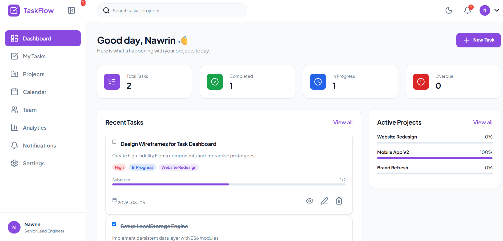
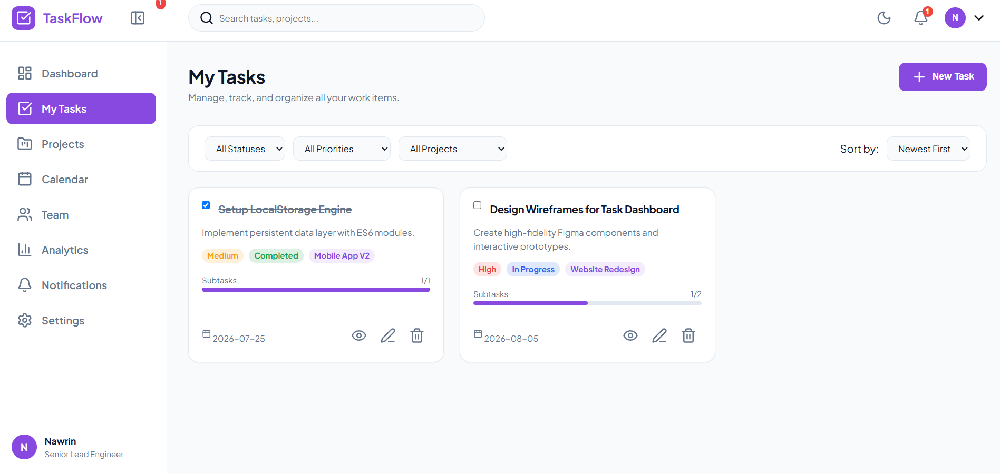
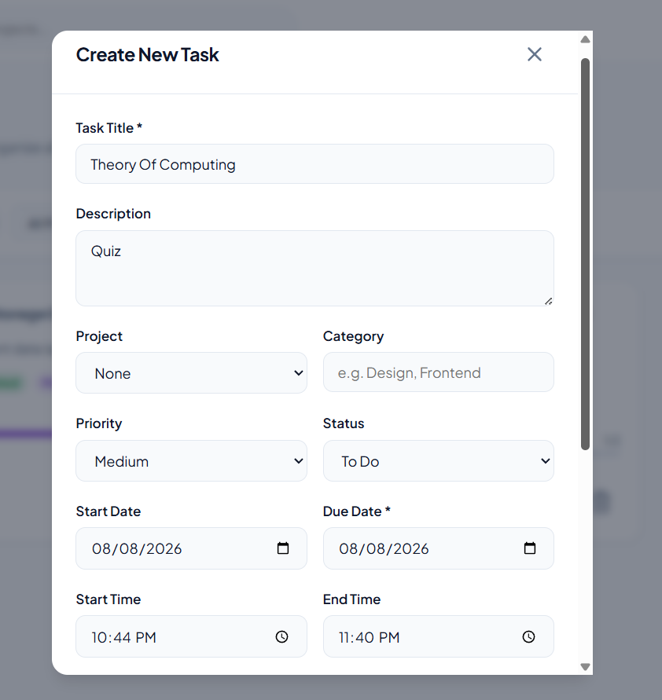
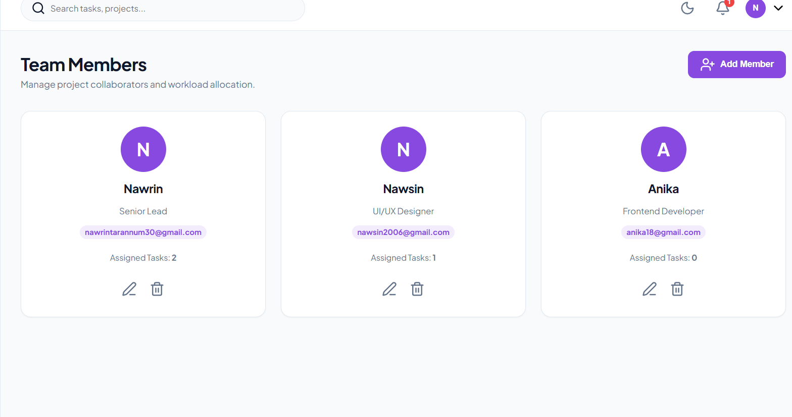
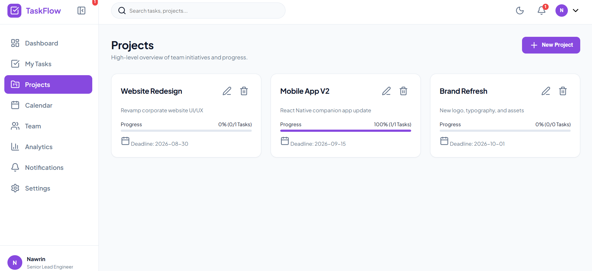
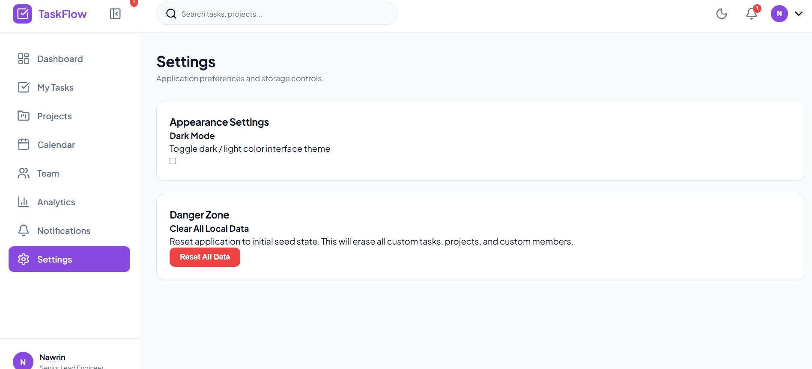
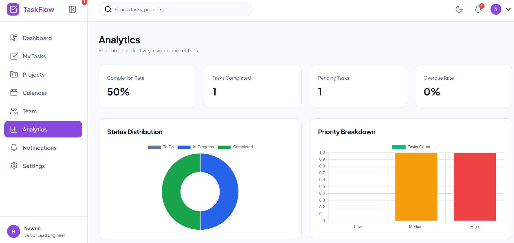

# TaskFlow — Modern SaaS Task & Project Management Web Application

TaskFlow is a production-grade, highly intuitive Task and Project Management SaaS application designed using pure HTML5, CSS3, and ES6+ Vanilla JavaScript. Built with modular state persistence via LocalStorage, TaskFlow delivers an expansive workflow environment tailored for engineering and design teams.

## 🌟 Key Features

- **Single Page Application (SPA) Engine:** Zero-reload view switching across 9 primary navigation modules with browser history & active state sync.
- **Complete Task & Subtask Engine (CRUD):** Real-time task creation, editing, detailed subtask checklist management, auto-calculated progress percentage, and automatic status transitioning.
- **Dynamic Real-Time Analytics:** Interactive metrics recalculation andChart.js integration displaying status and priority breakdowns.
- **Interactive Calendar:** Full-featured month grid navigation with click-to-filter schedule inspection.
- **Project & Team Workload Allocation:** Multi-project progress computation and active task workload counters for team members.
- **Notification Engine:** Live event trigger system for task creations, updates, and completions with mark-as-read/clear capabilities.
- **Universal Multi-Filter & Search:** Combine live fuzzy title search with filter criteria (Status, Priority, Project, and Sort Order).
- **Persistent Theme Engine:** Native dark and light mode interface with LocalStorage memory.
## Dashboard Preview

## 🚀 Getting Started

No node modules, build tools, or complex setups are required.

### Setup Instructions
1. Clone the repository:
   https://github.com/nawrin30/TaskFlow---Smart-Task-Project-Management-System 

   ## Author
   Nawrin Tarannum